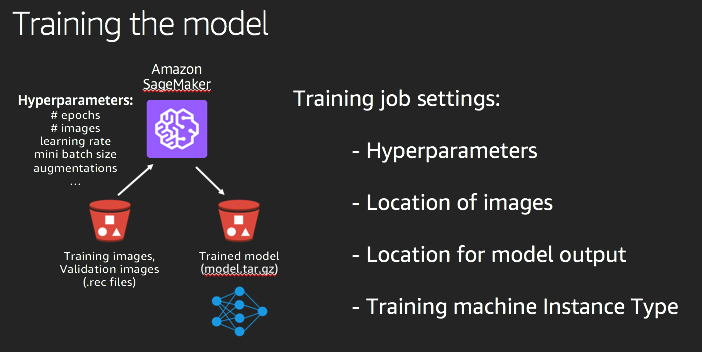

# Lab 2 - Train the classification model

In this lab, you will train an image classification model to identify bird species.  You will be using SageMaker's built-in Image Classification algorithm.  You can read the [documentation of the algorithm](https://docs.aws.amazon.com/sagemaker/latest/dg/image-classification.html) for additional background on how it works.

Here are the steps involved for this lab:

1. Create a SageMaker training job
2. View the results of the training

## Step 1 - Create a SageMaker training job

In this section, you will create a SageMaker training job to build your bird species identification model.  The resulting model artifacts will be used in a SageMaker endpoint to provide predictions.  Detailed documentation is available for SageMaker's Image Classification [hyperparameters](https://docs.aws.amazon.com/sagemaker/latest/dg/IC-Hyperparameter.html) as well as how to [train a model](https://docs.aws.amazon.com/sagemaker/latest/dg/IC-Hyperparameter.html) using Amazon SageMaker.

The following figure illustrates the training process at a high level.



### Create the job from the SageMaker console

Here are the detailed steps to train the model by creating a job from the console.  Note that you can also create training jobs using the SageMaker API, using the Python SDK from a SageMaker notebook, or even using the AWS CLI.

To create a job using the console, first click on `Training Jobs` on the left panel of the [SageMaker console](https://console.aws.amazon.com/sagemaker/home?region=us-east-1).  Then click on `Create Training Job`.  From there, you need to fill in the details of the job:

* Give the job a name: `birds`.
* Leave the IAM role as the default (something like `AmazonSageMaker-ExecutionRole-20180926T21970`).  If no default is provided, choose `Create a new role`.  SageMaker will ask you what level of S3 permissions to provide for this job.  For ease of use in the workshop, simply pick `Any S3 bucket` as the setting.  For production usage, you would want to be more specific.
* For the `Algorithm` setting, choose `Image classification` from the list of built in SageMaker algorithms.
* In the `Resource configuration` section, choose the `ml.p3.2xlarge` instance type.  Note that prior to this workshop, your workshop account had its resource limit increased (from 0 to 1) for using a p3 series instance type.  The p2 and p3 instance families provide GPU's, which are required for SageMaker's image classification algorithm.  If you were using your own AWS account, you may need to increase your resource limit as well.  The current default setting is 0.

The remaining 3 settings before the hyperparameters should be left at their default values:

* Leave the Encryption key as `No Custom Encryption`.
* Leave the stopping condition with the default `Maximum runtime` of 24 hours.
* Leave the Network as `No VPC`.

#### Define the hyperparameters

For SageMaker's Image Classification algorithm, there are more than two dozen hyperparameters.  For the purposes of this workshop, we will leave most of them at their default values.  Change only the following hyperparameters:

* **checkpoint_frequency**: 25.  A checkpoint saves the state of the neural network, so you could resume training from that state.  This is useful for large scale training, but is not important for this workshop.  We will set it to be the same exact number as the number of epochs.  That is, there will only be a single checkpoint, once all the training epochs for the lab have completed.
* **epochs**: 25.  For this size dataset on the selected instance type, this number of epochs will allow the job to complete in around 7 minutes with reasonable accuracy.  If you had more time available, you could improve the accuracy by doubling the number of epochs.
* **mini_batch_size**: 24.  This hyperparameter tells the algorithm how many images to process in a single mini batch.
* **num_classes**: 4.  If you were to use the full NABirds dataset, this would be 555.
* **num_training_samples**: 322.  If you were to use the full NABirds dataset, this would be > 40,000.
* **augmentation_type** 'crop'. This tells the algorithm to also flip each image horizontally to increase the model's ability to accurately identify species.  If a bird is facing left in the image, this augmentation will also train the model with a copy of the image with the bird facing to the right.
* **top_k**: 2.  This indicates to the algorithm that it should log an additional accuracy metric.  In addition to the accuracy of getting the prediction of the species exactly right, it will also log how accurate your model is at predicting the right species within the top 2 predictions for a given epoch.

For all other parameters, use default values.

#### Define the two data channels (train and validation)

Define two data channels to tell SageMaker where to find your packaged image files from Lab 1.  You will name them `train` and `validation` respectively.

* Name the first channel `train` for training data.
* Set the `Content type` as `application/x-recordio`.
* Set the `Compression type` to `None`.
* Set the `Record wrapper type` to `None`.
* Set the `S3 Data type` to `S3Prefix`.
* Set the `S3 data distribution type` to `FullyReplicated`.
* Set the `S3 location` to `s3://<bucket-name>/train/` (be sure to replace `<bucket-name>` with the name of your S3 bucket).  Double check the bucket name, as this is a common source of errors when creating training jobs through the SageMaker console.

To add the second channel, click on `Add channel` below the first channel.  Then follow these steps:

* Name the second channel `validation` for validation data.
* Set the `Content type`, `Compression type`, `Record wrapper type`, `S3 data type`, and `S3 data distribution type` to the same settings you used for the `train` channel.  Note that the values are not defaulted.
* Set the `S3 location` to `s3://<bucket-name>/validation/` (be sure to replace `<bucket-name>` with the name of your S3 bucket).  Also, be sure that this channel uses a `/validation/` folder, not a `/train/` folder.  Double check the bucket name, as this is a common source of errors when creating training jobs through the SageMaker console.  These locations align with the locations you provided when uploading the `.rec` packaged RecordIO files to S3 from the Jupyter notebook in Lab 1.

Click `Done` at the bottom of each data channel editor.

#### Set the S3 output path

For `S3 output path`, use `s3://<bucket-name>/`, replacing `<bucket-name>` with the name of your S3 bucket.  Note that you do not specify a folder underneath the bucket.  Double check the bucket name, as this is a common source of errors when creating training jobs through the SageMaker console.  This is the base path of the place where SageMaker will place the resulting model artifacts for the trained image classification model.  Under this base path, SageMaker will create a folder with the same name you provided for the training job, and under that it will create an `output` folder.  The artifacts will be in a file named `model.tar.gz`.  These model artifacts will be used by the inference engine hosted by the SageMaker endpoint that you will create in [Lab 3](lab3-host-model.md).

Leave the `Encryption key` field blank, as well as the `Tags`.  If you had large numbers of training job, you could use tags to help you more easily find and manage those jobs.  In our case, we have a single training job, so tags are not useful.

#### Finalize creation of the training job

Once all of your parameters for the job have been entered, click `Create training job`.  If your training job fails for any reason, you can easily `Clone` the training job, making any necessary changes before finally clicking `Create training job` for the new job.  

SageMaker first starts up the required infrastructure and then executes the training.  The infrastructure startup time will take a couple of minutes, and for our workshop, the training itself will take only 5 to 7 minutes to complete.  Depending on the number of images, their sizes, the number of epochs and checkpoints, and various other settings, training jobs for your own image classification projects may take many hours.  

While you are waiting for the model to be trained, proceed to Step 2 of this lab to view the progress of the training using CloudWatch.

### Other mechanisms for creating trained models using SageMaker

In the prior section, you created a training job from the SageMaker console by eventually clicking `Create training job`.  Note that you can train models using SageMaker from a Jupyter notebook, or from a CI/CD pipeline, or using the AWS CLI as well.

## Step 2 - View the progress of the training

* Click on training job to view details.
* Click on `View logs` in the `Monitoring` section towards the bottom of the page of job details.  
* Note that there is an `Output` section just below the `Monitoring` section.  Once the job is complete, you will see the S3 URI to the model artifacts (the `model.tar.gz` file).  You may want to copy that URI from here when doing Lab 3.
* Note that it could take a couple of minutes for the training job infrastructure to be instantiated, before the training job is executing and the log files are available for viewing.  If you try to view the logs before they are created, you may see an error.  Don't be alarmed.  Simply wait until the training job is truly executing.
* Pick the latest log stream.
* You will see logging of progress for each epoch of the training job.  Pay attention to `Validation-accuracy` in the log output, as it should be steadily increasing.  If you had more time available, you could significantly increase the number of epochs and see additional accuracy improvements.  

To make it easier to see the epoch-by-epoch progress of improving accuracy, you can enter `"Validation-accuracy"` (including the double quotes at each end) in the CloudWatch `Filter events` text box.  You could then see output such as the following:

```
16:12:54 [10/21/2018 16:12:53 INFO 139701434767168] Epoch[0] Validation-accuracy=0.302083
16:12:58 [10/21/2018 16:12:57 INFO 139701434767168] Epoch[1] Validation-accuracy=0.291667
16:13:02 [10/21/2018 16:13:01 INFO 139701434767168] Epoch[2] Validation-accuracy=0.177083
16:13:06 [10/21/2018 16:13:05 INFO 139701434767168] Epoch[3] Validation-accuracy=0.366667
16:13:10 [10/21/2018 16:13:09 INFO 139701434767168] Epoch[4] Validation-accuracy=0.291667
16:13:14 [10/21/2018 16:13:13 INFO 139701434767168] Epoch[5] Validation-accuracy=0.441667
16:13:18 [10/21/2018 16:13:17 INFO 139701434767168] Epoch[6] Validation-accuracy=0.541667
16:13:22 [10/21/2018 16:13:21 INFO 139701434767168] Epoch[7] Validation-accuracy=0.708333
16:13:26 [10/21/2018 16:13:25 INFO 139701434767168] Epoch[8] Validation-accuracy=0.718750
16:13:30 [10/21/2018 16:13:29 INFO 139701434767168] Epoch[9] Validation-accuracy=0.675000
16:13:34 [10/21/2018 16:13:33 INFO 139701434767168] Epoch[10] Validation-accuracy=0.750000
16:13:38 [10/21/2018 16:13:37 INFO 139701434767168] Epoch[11] Validation-accuracy=0.750000
16:13:42 [10/21/2018 16:13:41 INFO 139701434767168] Epoch[12] Validation-accuracy=0.770833
16:13:46 [10/21/2018 16:13:45 INFO 139701434767168] Epoch[13] Validation-accuracy=0.783333
16:13:50 [10/21/2018 16:13:49 INFO 139701434767168] Epoch[14] Validation-accuracy=0.843750
16:13:54 [10/21/2018 16:13:53 INFO 139701434767168] Epoch[15] Validation-accuracy=0.833333
16:13:58 [10/21/2018 16:13:57 INFO 139701434767168] Epoch[16] Validation-accuracy=0.885417
16:14:02 [10/21/2018 16:14:01 INFO 139701434767168] Epoch[17] Validation-accuracy=0.875000
16:14:06 [10/21/2018 16:14:05 INFO 139701434767168] Epoch[18] Validation-accuracy=0.875000
16:14:10 [10/21/2018 16:14:09 INFO 139701434767168] Epoch[19] Validation-accuracy=0.858333
```

Notice that the accuracy will not simply follow a linear straight path of improvement.  In the above example, the accuracy was highest after epoch 16.

Here is some sample output from a single epoch:

```
...
16:14:05 [10/21/2018 16:14:04 INFO 139701434767168] Epoch[18] Train-accuracy=0.766026
16:14:05 [10/21/2018 16:14:04 INFO 139701434767168] Epoch[18] Train-top_k_accuracy_2=0.932692
16:14:05 [10/21/2018 16:14:04 INFO 139701434767168] Epoch[18] Time cost=3.071
16:14:06 [10/21/2018 16:14:05 INFO 139701434767168] Epoch[18] Validation-accuracy=0.875000
16:14:06 [10/21/2018 16:14:05 INFO 139701434767168] Epoch[18] Validation-top_k_accuracy_2=0.968750
...
```

As stated earlier, once the job is complete (console will show a green `Completed` status), the training model artifacts are saved in `model.tar.gz` in the specified output directory.  Navigate to the S3 console, and drill down into your S3 bucket to find the model artifacts.  That file will be used to create a model for inference in the next lab.

## Navigation

Go to the [Next Lab](lab3-host-model.md)

[Home](../README.md) - [Lab 1](lab1-image-prep.md) - [Lab 2](lab2-train-model.md) - [Lab 3](lab3-host-model.md) - [Lab 4](lab4-trigger-inference-from-s3.md) - [Lab 5](lab5-deeplens-detect-and-classify.md) - [Lab 6](lab6-text-notification.md) - [Troubleshooting](troubleshooting.md)
