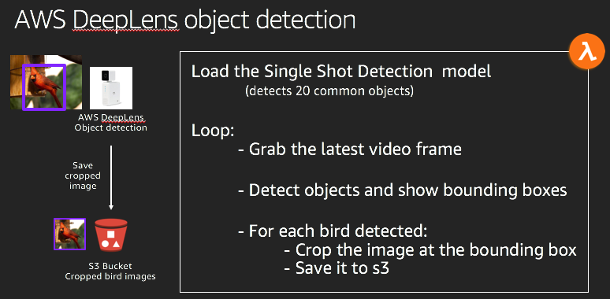
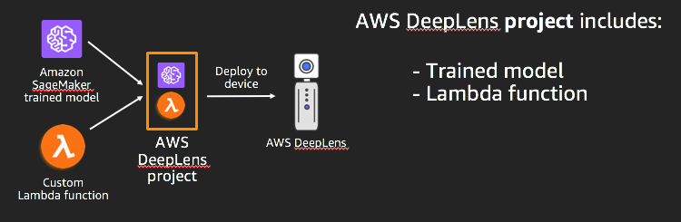
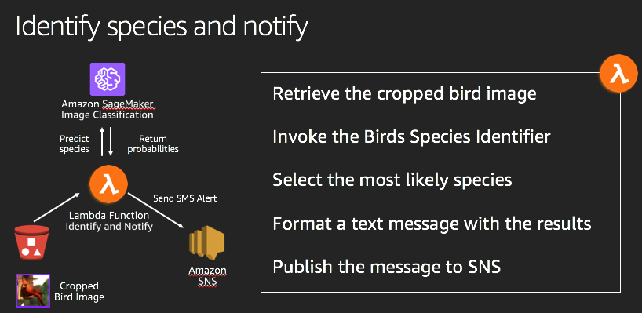

# Lab 5 - Use AWS DeepLens to detect birds and trigger classification

In this lab, you will use AWS DeepLens to detect birds and trigger classification of the bird species.  The following figure illustrates a high level view of the Lambda function that executes on the AWS DeepLens to detect birds and save  a cropped image of each bird detected.

 

Here are the steps you will use in this lab:

1. Register the DeepLens device
2. Deploy the Object Detection sample project provided with AWS DeepLens
3. Customize the object detection project
4. Re-deploy the updated project
5. Test the project

## Register the DeepLens device

Here are the steps required to register your DeepLens device.  The standard instructions provided for the product are found [here]( https://docs.aws.amazon.com/deeplens/latest/dg/deeplens-getting-started-register.html).

### Step 1 - Name the device and download a new certificate

* Power up your AWS DeepLens device.
* Navigate to the [AWS DeepLens console](https://console.aws.amazon.com/deeplens/home?region=us-east-1#devices).
* Name the device.  Use the name provided on a sticker on the device (e.g., `L25`).
* Permissions.  The DeepLens required permissions should be all set for your workshop ahead of time, so you should see a green circle with a check mark next to `IAM roles for DeepLens`.  If not, please refer to [these instructions](https://docs.aws.amazon.com/deeplens/latest/dg/deeplens-getting-started-register.html).
* Certificate.  Download the certificate to be used on the device.  Do not open the zip file, but simply download it and remember where you saved it.  You will need to upload this certificate to the device in an upcoming step.
* Click `Next`.

### Step 2 - Connect to the DeepLens softAP WiFi

* Use paper clip to enable the device softAP WiFi.  You will connect to the device WiFi to upload the certificate.
* Once the middle light on the device is blinking, connect to the device WiFi.  The SSID is shown on the sticker on the device (e.g., `AMDC-UB82`).  Note that if you are connected to your work VPN, you should disconnect before trying to connect to the DeepLens WiFi.
* Once you are connected to the device WiFi, click `Next` to continue the setup.  This will take you to a configuration page running on the DeepLens device.  If you have errors when trying to connect, review the [troubleshooting steps](troubleshooting.md).

### Step 3 - Upload the certificate to the device

* Under the `Network connection` section, ensure that it is configured to a `Wired connection` using `Ethernet-USB Adapter`. If it is not, click `Edit` and then choose `Use Ethernet`.
* In the `Certificate` section, you need to upload the certificate that you downloaded earlier.  Click `Edit` even if it looks like there is already a certificate attached.  If there is one already listed, it is from an earlier registration and it will **not** work for your new registration.  
* Leave the device password as is.  For this workshop, you will see the password on a sticker on the device.
* After clicking `Edit`, click `Browse` and locate the certificate zip file (e.g., `certificates-deeplens_JVHM9GHxSqRE84fw.zip`) you downloaded earlier.  Depending on the version of the software running on the AWS DeepLens, you may also need to then click `Upload zip file`.  
* Once the file upload is complete, click `Save` to return to the main configuration screen, or click `Finish`.  This will disconnect you from the device WiFi, and will complete the registration on the device.

### Step 3 - Complete the device registration

* Re-connect to your network (non-device WiFi, or Ethernet).
* Now you will return to the console by clicking `AWS management console`.
* Click `Devices` on the left hand panel of the DeepLens console in the `Resources` section.
* For your device, you should see `Registration status` of `Registered`, and a `Device status` of `Online`.  
* It is possible that the `Device status` says `Deployment in progress`.  If so, give it a couple of minutes.  If that status will not change, try the [troubleshooting steps](troubleshooting.md).
* If your `Device status` is `Update available`, scroll down to the `Device Details` section and click `Update` to update the device software.

## Deploy off the shelf object detection project

The following figure illustrates the composition of an AWS DeepLens project.



Here are the detailed steps you will follow to deploy the project:

### Step 1 - Create a project

* Click `Deploy a project`.
* On the `Projects` console, click `Create new project`.
* Use a project template called `Object detection`.  Click `Next`, and then click `Create`.  Project creation could take a few seconds.  You will know that the project is fully created when you see `Description`, `Creation time`, and `Last updated` are populated in the console.  Once you see a green banner at the top of the page indicating a successful creation, click your web browser refresh button if those fields are still blank.

### Step 2 - Deploy it to the device

* Once the project is created, select it, and click `Deploy to device`. Pick the device you registered in the previous step. Click `Review`. Click `Deploy`.
* You will see the status at the top of the page in a blue box, and it will indicate `Deployment of project is in progress`.  A percent completion of the model download will be displayed.  Once the model is downloaded, the device will create a Greengrass deployment.  This progress will be indicated in the blue banner at the top of the page.  After a few minutes, you will see the status bar change from blue to green indicating `Deployment of project succeeded`.
* Soon thereafter, the topmost blue light on the device should turn on and remain lit.  All three blue lights should be lit when the model is downloaded and is running.

## Test the project

Login to the device using the keyboard and monitor.  `aws_cam` is the username.  `Aws2018!` is the password.

Once the desktop is displayed, right click on the desktop and select `Open Terminal`.  In the terminal window, launch a viewer to see the project stream being provided by the AWS DeepLens device.  The following command in the terminal window will launch a new project viewer window:

```
mplayer -demuxer lavf -lavfdopts format=mjpeg:probesize=32 /tmp/results.mjpeg
```
This will bring up a new window showing you what the device is seeing.  For the Object Detection project, it will also show you blue bounding boxes and confidence levels each time it identifies one of the 20 objects it has been trained to detect (e.g., person, sofa, tv monitor).

## Customize the object detection project to identify birds

### Review the code you will be providing

Now you will customize the object detection project to use a new function that will perform specific actions when it detects a bird object:

* Display a bold purple bounding box to highlight the bird.
* Crop the scene to that bounding box.
* Save the cropped image as a jpg file to a `birds` folder in your S3 bucket.

The following figure illustrates how the customized Lambda function interacts with the cropped image in S3, the trained model in SageMaker, and SNS for notification.



In this section, we will review some of the key pieces of code that are used in the customized object detection function.  The [full code](../labs/lab5/greengrassHelloWorld.py) can be seen in `labs/lab5/greengrassHelloWorld.py`.

#### Code for cropping the image and calling the 'push_to_s3' function

Here is the code from the main loop of the inference function.  If the object detection model finds any birds, each one is cropped and saved to S3.

```
# If it's a bird, crop the image and save a copy to s3
# if we haven't detected birds in the last few seconds
if ((obj_name == 'bird') and (time_window > S3_PUSH_THROTTLE_SECONDS)):
    # crop and push, add a buffer around the bounding box area that
    # the single shot detection model provides, so that we don't end up
    # trimming any body parts of the bird
    crop_img = frame_without_boxes[(ymin - (3 * BIRD_BOX_THICKNESS)):(ymax + (3 * BIRD_BOX_THICKNESS)), 
                                   (xmin - (3 * BIRD_BOX_THICKNESS)):(xmax + (3 * BIRD_BOX_THICKNESS))]
    push_to_s3(crop_img, i)

    # remember the time of the last push
    last_bird_pushed = timestamp

# Store label and probability to send to cloud
cloud_output[output_map[obj['label']]] = obj['prob']
```

#### Code from 'push_to_s3' for publishing the cropped image to S3

Here is code from a utility function called `push_to_s3` that takes the cropped image, encodes it as a jpg file, and creates an S3 object from that file.  It stores the file in the `birds` folder in the supplied S3 bucket, and it automatically creates subfolders based on date and time for an organized collection of cropped images.

```
timestamp = int(time.time())
now = datetime.datetime.now()
key = "birds/{}_{}/{}_{}/{}_{}.jpg".format(now.month, now.day,
                                           now.hour, now.minute,
                                           timestamp, index)
s3 = boto3.client('s3')

encode_param = [int(cv2.IMWRITE_JPEG_QUALITY), 90]
_, jpg_data = cv2.imencode('.jpg', img, encode_param)

response = s3.put_object(ACL='public-read',
                         Body=jpg_data.tostring(),
                         Bucket=BUCKET_NAME,
                         Key=key)
```

### Detailed steps for customizing the project function

Here are the steps to follow to customize the project.

* Click on `Projects` in the `Resources` section of the left hand panel of the AWS DeepLens console.
* Click on the name of the project you created earlier.  The console will take you to the details page for that project.
* Click on the **name of the function** (e.g., `deeplens-object-detection/versions/1`), which will take you to the Lambda console.
* Once you are in the Lambda console for the function, click on `Go to $LATEST` so that you can edit the function in the console.
* Paste in the updated function from [labs/lab5/greengrassHelloWorld.py](../labs/lab5/greengrassHelloWorld.py).
* Set the environment variables.  Note that if you forget to add these environment variables, your project will deploy successfully but will not run.  The top blue light will never turn on.  Here are the three environment variables you need to set:

```
BUCKET_NAME = <your bucket>
DETECTION_THRESHOLD = 0.55
S3_PUSH_THROTTLE_SECONDS = 4
```
* Click `Save` to save the project with the updated function code and environment variables.
* On the `Actions` menu, click `Publish new version`. Note the new version number.  Add a comment. Click `Publish`.

### Updating the DeepLens project to use the new version of the function

Follow these steps to update your DeepLens project so that it uses the new version of the Lambda function you just created:

* Return back to DeepLens `Projects` console.  Click on `Edit` to edit the project content.  This button is on the far right hand side of the `Project` section.
* Once you are on the `Edit project` page, click on `Function` (not the name of the function) in the `Project Content` section to expand the project function editor.  
* Choose the new version number that you just published (should be the largest version number in the list).
* Click `Save` at the bottom of the page to save your project edits.  Note that when you are back on the screen with the list of projects, it will also show a version number of the DeepLens project itself.  That is completely independent of the version number of the Lambda function.

## Re-deploy

* Select your project.
* Click on `Deploy to device`.  
* Select your device.  Click `Review`. Confirm that you want to overwrite the project that is already deployed on the device. Click `Deploy`. This process then takes a couple of minutes to complete the deployment and then another minute for the project to run, which is indicated by the top blue light staying lit.  Note that the project viewer window that was running on your DeepLens attached monitor will go away when the deployment is complete since the old project will have been removed.

## Test

### Show some bird pictures to your DeepLens device

Once all three blue lights on the AWS DeepLens device are lit, your new customized bird classifier model is running.  From your DeepLens terminal, use `mplayer` again to view the device's project video stream:

```
mplayer -demuxer lavf -lavfdopts format=mjpeg:probesize=32 /tmp/results.mjpeg
```

Hold a bird picture in front of the DeepLens.  Hold it steady.  Keep it about 8 to 12 inches from the device.  You should see it in the `mplayer` window, and you should see that the bird is detected and highlighted with a thick purple bounding box.

**insert picture here**

### Check to see that the cropped image was saved to S3

Now check to see if the project was successful cropping the image and saving it to S3.  Go to your bucket.  Be sure to click the S3 refresh symbol (to the right of the name of the current region).  Otherwise, you will not be seeing the latest state of the S3 bucket.

Navigate to the `birds` folder.  You will see a new folder created for today's date (`mm_dd` format).  Within that folder, there will be subfolders for each minute in which there was a bird pushed (`hh_mm`, where the hours are in military time and `mm` represents minutes).  Preview the jpg file to see the cropped image that was saved from the DeepLens to S3.

### Now find out what species was identified

There are two ways that you can find out what bird species was identified:

1. Review the logs for the `IdentifySpeciesAndNotify` Lambda function.
2. Use the AWS IoT console.  **ensure IoT permissions in user's IAM policy.**

Let's look at the detailed steps.

#### Reviewing Lambda logs for species

Go to the AWS Lambda console and select the `IdentifySpeciesAndNotify` function.  Click on the `Monitoring` tab.  Click on the `View logs in CloudWatch` button on the upper right corner of the screen above the metrics charts.

In CloudWatch, open the log stream that has the most recent event time.  Scan the log for output from your Lambda function.  Log entries for invocations are bracketed by an initial entry of `START RequestId` and a closing log entry of `REPORT RequestId` which displays the duration and memory size information.  If everything worked well, you will see an entry that starts with `msg` that will show you the results of the species identification.  Note that the S3 key for the cropped bird image object is also logged (e.g., `birds/10_13/15_9/1539457777_0.jpg`) and can be a useful aid in troubleshooting if required.

If you do not find `msg` entries, you may see an entry that says `An error occurred`.  One common example would be that you do not have your SageMaker endpoint up and running with the correct endpoint name (i.e., `nabirds-species-identifier`).

#### Using the IoT console to see the bird species results

From the DeepLens device page of the console, copy the IoT subscription topic and navigate to the IoT console.  Paste in the subscription topic.  Now show another bird to the device.  You should see the results in the IoT console.

## Navigation

Go to the [Next Lab](lab6-text-notification.md)

[Home](../README.md) - [Lab 1](lab1-image-prep.md) - [Lab 2](lab2-train-model.md) - [Lab 3](lab3-host-model.md) - [Lab 4](lab4-trigger-inference-from-s3.md) - [Lab 5](lab5-deeplens-detect-and-classify.md) - [Lab 6](lab6-text-notification.md) - [Troubleshooting](troubleshooting.md)
